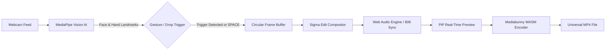

<div align="center">

# ⚡ REAL-TIME PHONK WEB EDITOR
### *Tactical Computer Vision Monitor & Automated Phonk Edit Generator*

[](https://react.dev/)
[](https://www.typescriptlang.org/)
[](https://vitejs.dev/)
[](https://developers.google.com/mediapipe)
[](https://tailwindcss.com/)
[](https://webassembly.org/)
[](LICENSE)

<br />

> 🌐 **Live Demo**: `Coming Soon` *(Link will be provided later)*

---

</div>

## 📌 Table of Contents
- [Overview](#-overview)
- [Key Features](#-key-features)
- [Preset Styles](#-preset-styles)
- [Architecture & Pipeline](#-architecture--pipeline)
- [Keyboard Controls & Cheatsheet](#-keyboard-controls--cheatsheet)
- [Tech Stack](#-tech-stack)
- [Quick Start](#-quick-start)
- [Project Directory](#-project-directory)
- [Privacy & Security](#-privacy--security)
- [Original Credits](#-original-credits)
- [License](#-license)

---

## ⚡ Overview

**Real-Time Phonk Web Editor** is an on-device, browser-native AI video generation workstation. Leveraging Google's **MediaPipe Vision AI** and the **Web Audio API**, the application continuously tracks facial landmarks, 3D Euler angles (pitch, yaw, roll), and hand coordinates directly through your webcam feed at 60 FPS.

When an action trigger is detected—such as taking a drink sip, tilting your head, or adjusting your glasses—the engine automatically cuts to a tempo-synced **Phonk Beat Drop Edit** complete with:
- Dynamic slow-motion frame interpolation
- Screen-shaking 808 bass sync
- Chromatic aberration, CRT scanlines & ghost trails
- Dark manga high-contrast strobe glitches
- Real-time client-side MP4 video rendering

No cloud processing, no server latency—everything runs **100% locally** in the browser.

---

## ✨ Key Features

### 🧠 Real-Time On-Device AI Vision
* **468+ Facial Landmarks**: Sub-millisecond face & hand mesh tracking accelerated by WebGL/GPU delegates.
* **Intelligent Action Recognition**:
  * ☕ **Drink Sip Detection**: Monitors mouth proximity, cup posture, and head tilt.
  * 👓 **Glasses Adjust**: Detects elevation and proximity around the temples and eyes.
  * ⚡ **Dual Triggering**: Concurrently listens for multiple gesture states.
  * 🎛️ **Adaptive Sensitivity**: Switch dynamically between `NORMAL`, `HIGH`, and `HYPER`.

### 🎯 3D Perspective Tactical HUD
* **3D Euler Wireframe Box**: Real-time perspective-projected wireframe target cube anchored to head pose.
* **Cyberpunk Tactical Metrics**: Millisecond timecode display, CAM-01 target acquisition overlays, and audio reactive frequency bars.
* **Mirror & Device Control**: Instant camera switching and horizontal mirror toggle.

### 🔊 Phonk Audio Synthesizer & Soundboard
* **Millisecond-Accurate Drop Timing**: Audio engine accurately queues drops to match peak visual frames.
* **Integrated Phonk Library**: Includes hits like *Montagem Tomada*, *Marlon Mogged*, and *Mogger*.
* **Interactive Soundboard**: On-demand meme SFX triggers, 808 bass cannons, and vinyl scratches.

### 🎬 Fast-Start MP4 WebAssembly Export
* **Circular In-Memory Buffer**: Keeps a rolling history of pre-roll and post-roll video frames in RAM.
* **Instant Export**: Uses `@mediabunny` and `@mediabunny/aac-encoder` (WASM AAC) to compile standard MP4 videos ready for TikTok, Shorts, or Reels without server uploads.

---

## 🎨 Preset Styles

| Preset | Track | Visual Profile & Post-Processing |
| :--- | :--- | :--- |
| **👻 GHOST TRAILS** | *Montagem Tomada* | Ethereal slow-motion ghost trails, afterimages, neon cyan/magenta beat pulses, and chromatic aberration. |
| **🗿 SIGMA SNAPS** | *Marlon Mogged* | Hard beat cuts, extreme zooms, bass camera shake, mogger overlays, and high-impact wasted aesthetic. |
| **⚡ DARK MANGA** | *Mogger Phonk* | High-contrast black & white inversion, negative-film flashes, and lightning-fast strobe glitches. |

---

## 🔄 Architecture & Pipeline



---

## 🎮 Keyboard Controls & Cheatsheet

| Key / Control | Action |
| :--- | :--- |
| <kbd>SPACE</kbd> | **Force Drop / Trigger**: Manually initiate phonk edit sequence immediately. |
| **PRESETS** | Switch between *Ghost Trails*, *Sigma Snaps*, and *Dark Manga*. |
| **TRIGGER MODE** | Cycle gesture trigger: `BOTH`, `DRINK`, or `GLASSES`. |
| **SENSITIVITY** | Cycle sensitivity threshold (`NORM` ➔ `HIGH` ➔ `HYPER`). |
| **CAMERA** | Cycle available video input devices. |
| **MIRROR** | Toggle horizontal video flip. |
| **AUDIO / TRACKS** | Toggle master mute or open soundboard modal. |
| **DOWNLOAD MP4** | Export and save generated MP4 clip. |
| **FULLSCREEN** | Toggle immersive edge-to-edge view. |

---

## 🛠️ Tech Stack

* **Frontend**: [React 18](https://react.dev/), [TypeScript 5](https://www.typescriptlang.org/)
* **Build System**: [Vite 6](https://vitejs.dev/)
* **Styles**: [Tailwind CSS 3](https://tailwindcss.com/) + Custom Cyberpunk CSS
* **Computer Vision**: [Google MediaPipe Tasks Vision](https://developers.google.com/mediapipe/solutions/vision)
* **Audio Processing**: Web Audio API + HTML5 Audio
* **Video Encoding**: [Mediabunny](https://github.com/Vanilagy/mediabunny) + [@mediabunny/aac-encoder](https://www.npmjs.com/package/@mediabunny/aac-encoder)
* **Icons**: [Lucide React](https://lucide.dev/)
* **Particles / FX**: [Canvas Confetti](https://www.npmjs.com/package/canvas-confetti)

---

## 🚀 Quick Start

### Prerequisites
* [Node.js](https://nodejs.org/) (v18.0 or newer)
* [npm](https://www.npmjs.com/) or [pnpm](https://pnpm.io/)
* Modern browser with WebRTC webcam and WebGL support (Chrome, Edge, Brave recommended)

### Installation

1. **Clone the repository**:
   ```bash
   git clone https://github.com/AadishY/real-time-phonk-web-editor.git
   cd real-time-phonk-web-editor
   ```

2. **Install dependencies**:
   ```bash
   npm install
   ```

3. **Start local development server**:
   ```bash
   npm run dev
   ```
   Open `http://localhost:5173` in your browser.

4. **Build for production**:
   ```bash
   npm run build
   ```

5. **Preview production build**:
   ```bash
   npm run preview
   ```

---

## 📁 Project Directory

```text
real-time-phonk-web-editor/
├── public/
│   ├── audios/              # Fallback audio assets
│   ├── models/              # TFLite selfie segmenter models
│   └── pngs/                # Meme overlays & graphics
├── src/
│   ├── audios/              # Bundled phonk tracks
│   ├── components/
│   │   ├── ControlsBar.tsx  # Tactical bottom controls HUD
│   │   ├── EditOverlay.tsx  # Dynamic reaction & meme overlays
│   │   ├── PipPlayer.tsx    # PiP preview & MP4 download
│   │   ├── SoundboardModal.tsx # Audio selector & meme soundboard
│   │   └── TacticalHUD.tsx  # Cyber HUD metrics & timecode
│   ├── services/
│   │   ├── cameraManager.ts    # WebRTC feed & device management
│   │   ├── clipRecorder.ts     # Canvas recording & WASM MP4 export
│   │   ├── cube3dRenderer.ts   # 3D Euler perspective target box
│   │   ├── frameBuffer.ts      # Circular RAM frame buffer
│   │   ├── phonkAudioEngine.ts # Web Audio synthesis engine
│   │   ├── selfieSegmenter.ts  # Background isolation
│   │   ├── sigmaEditRenderer.ts# Phonk edit compositor (zooms, strobes)
│   │   └── visionDetector.ts   # MediaPipe Face & Hand tracking
│   ├── types/               # TypeScript interfaces
│   ├── App.tsx              # Main orchestrator
│   ├── index.css            # Tactical typography & base styles
│   └── main.tsx             # Entry point
├── package.json
├── tailwind.config.js
├── tsconfig.json
├── vercel.json
└── vite.config.ts
```

---

## 🔒 Privacy & Security

* **Zero Cloud Latency**: 100% of video streaming, facial landmark detection, audio processing, and rendering happen on-device inside your browser.
* **No Server Data Transmission**: No video feeds, telemetry, or biometric details are uploaded or stored.

---

## 👤 Original Credits

> [!NOTE]
> Original concept, implementation, and creative direction by [**am1t_build**](https://github.com/amitsikdar37) (**@am1t_builds**).  
> Thank you to `am1t_build` for the original open-source release and inspiration!

---

## 📄 License

This project is open-source software licensed under the [MIT License](LICENSE).
